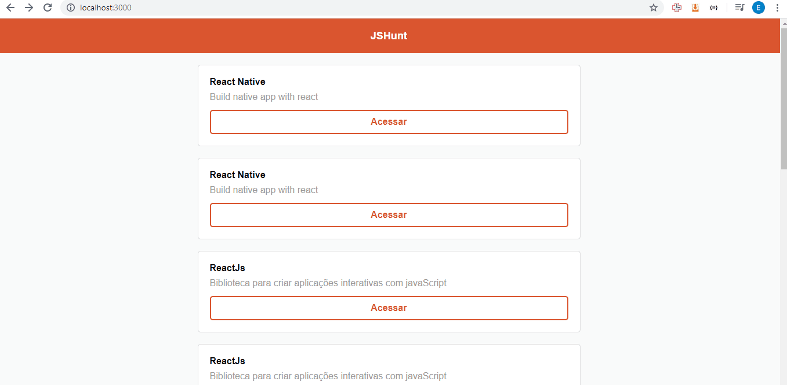

# JSHuntWeb
Simples aplicação web desenvolvida em ReactJs durante o curso starter da rocketseat. A aplicação contém uma single page, com uma lista de repositórios e consome uma API em node contendo informações sobre esses repositórios. como a API não está hospedada em nenhuma plataforma, será necessario baixar e execultar a API localmente, a API se encontra nesse [Link](https://github.com/emaanuelsilvaa/JSHuntNodeAPI).

## Executando o projeto

Primeiramente é necessario ter o NodeJS instalado. logo, basta baixar o projeto, entrar na pasta do projeto com o comando `cd JSHuntWeb`, instalar as dependências com o comando `npm install`, e em seguida roda o projeto com `npm start`, se tudo ocorrer bem a aplicação será execultada. 

  

## Meta

Emanuel Silva – emanuelborgesdasilva@gmail.com

Distribuído sob MIT License. Veja [LICENSE.md](LICENSE) para mais informações.

